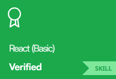
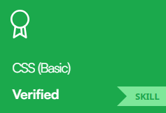

 
<!--### 
Hi There ! 
-->

- 🔭 I’m currently a Student at Ho Chi Minh City University of Industry and Trade (HUIT)
- 📫 How to reach me: [Facebook]
- 🫀 Hobby: I love to see the scenery and flowers 🥰

<!--END_SECTION:waka-->

[Facebook]: https://www.facebook.com/iustt31

### 🛠 Languages and Tools

                                       

> ## 🐱My Certificates
>
>  <a href="./Certificate/java_basic_hackerraank.png">
>    
> </a>
>  <a href="./Certificate/sql_basic_hackerrank.png">
>    
> </a>
> <a href="./Certificate/sql_interm_hackerrank.png">
>    
> </a>
> <a href="./Certificate/python_basic_hackerrannk.png">
>    
> </a>
>  <a href="./Certificate/javascript_inter_hackerrank.png">
>    
> </a>
>  <a href="./Certificate/restapi_hackerrank.png">
>    
> </a>
>  <a href="./Certificate/jsbasic_hackerrank.png">
>    
> </a>
> <a href="./Certificate/sql_advance_hackkerrank.png">
>    
> </a>
> <a href="./Certificate/fd_react_hackerrank.png">
>    
>  </a>
> <a href="./Certificate/SE_Intern_hackerrank.png">
>    
>   </a>
> <a href="./Certificate/SE_hackerrank.png">
>    
>   </a>
> <a href="./Certificate/react_basic_hackerrank.png.png">
>    
>   </a>
> <a href="./Certificate/css_basic_hackerrank.png.png.png">
>    
>   </a>

<table>
  <tbody>
    <tr>
      <td>
        
      </td>
    </tr>
  </tbody>
  <tbody>
    <tr>
      <td>
        
      </td>
    </tr>
  </tbody>  
</table>

###  GitHub Stats

<table>
  <tbody>
    <tr>
      <th>
        
      </th>
      <th>
        
      </th>
    </tr>
  </tbody>
  <tbody>
    <tr>
      <td>
        
      </td>
      <td>
        
      </td>
    </tr>
  </tbody>
</table>
